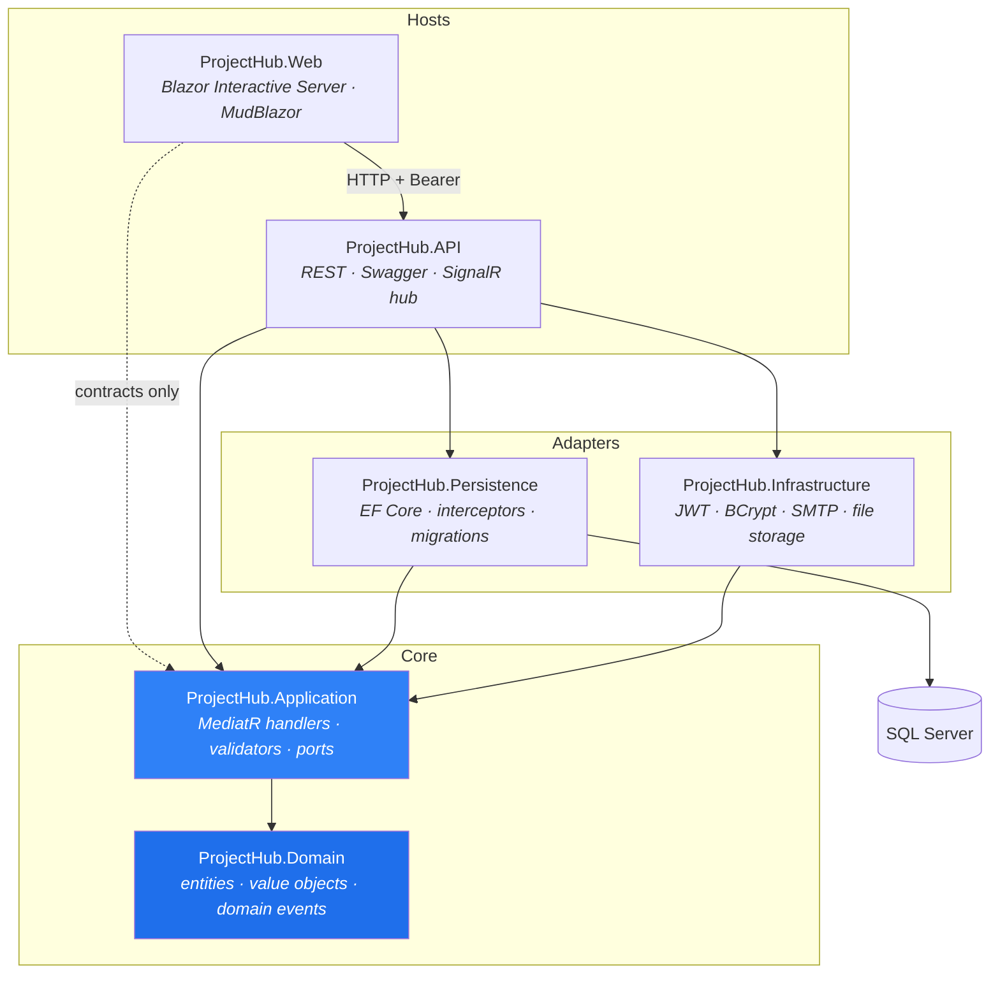

# ProjectHub

**An enterprise project-management platform built on .NET 9 with Domain-Driven Design and Clean Architecture.**

Projects, sprints, and a Kanban task board, with a field-level audit trail and real-time notifications — split into a REST API and a Blazor Server front end that talks to it over HTTP like any other client.

[](https://dotnet.microsoft.com/)
[](https://learn.microsoft.com/ef/core/)
[](https://www.microsoft.com/sql-server)
[](https://learn.microsoft.com/aspnet/core/blazor/)
[](https://mudblazor.com/)
[](#testing)
[](#architecture)

---

## Table of contents

- [Why this project exists](#why-this-project-exists)
- [Features](#features)
- [Architecture](#architecture)
- [Tech stack](#tech-stack)
- [Getting started](#getting-started)
- [Configuration](#configuration)
- [Project structure](#project-structure)
- [API reference](#api-reference)
- [Authorization model](#authorization-model)
- [Audit trail](#audit-trail)
- [Real-time notifications](#real-time-notifications)
- [Database](#database)
- [Testing](#testing)
- [Conventions](#conventions)
- [Roadmap](#roadmap)
- [License](#license)

---

## Why this project exists

ProjectHub is a reference-quality implementation of the patterns that usually get _described_ in blog posts but rarely shown working end to end:

- A **domain model that actually enforces its invariants** — private setters, factory methods, value objects, and `DomainException` rather than anemic DTOs with public properties.
- **Domain events dispatched after commit**, in the same request scope, driving side effects (notifications) without coupling handlers to each other.
- A **SaveChanges interceptor that writes a real audit trail** — one row per changed aggregate, with a field-level JSON diff, enlisted in the same transaction as the change that produced it.
- **Authorization enforced at the handler**, not just at the controller — and read paths that return `NotFound` instead of `Forbidden` so they never disclose the existence of resources you can't see.
- A front end that is a genuine **API consumer**: the Blazor host cannot reference `Persistence` or `Infrastructure`, so it physically cannot reach the database.

Every non-obvious decision in the codebase is documented in an XML `<remarks>` block next to the code that depends on it.

---

## Features

### Projects & delivery

- **Projects** with archive/restore, description history, and a member roster
- **Sprints** with a `DateRange` value object, start/complete transitions, and status chips
- **Tasks** — create, assign, reprioritize, and move across a **Kanban board** (`Todo → InProgress → InReview → Done`)
- **Comments** on tasks with edit support
- **File attachments** with pluggable storage (`IFileStorage`, local-disk implementation included)
- **Full-text search** across projects and tasks

### Identity & access

- Registration, login, email confirmation, forgot/reset password
- **JWT RS256** access tokens (15 min) plus rotating **refresh tokens**, hashed at rest
- Passwords hashed with **BCrypt**
- **Two independent role systems** — global (`Admin` / `Manager` / `Member`) and per-project (`Viewer` / `Contributor` / `Maintainer` / `Owner`) — see [Authorization model](#authorization-model)

### Oversight

- **Audit trail** with field-level JSON diffs across six aggregate types, scoped to project members
- **Admin audit viewer** (`/admin/audit`) — every change in the system, filterable by entity, project, actor, and date range
- **Admin user management** (`/admin/users`) — activate/deactivate accounts, grant/revoke global roles, with self-lockout guards
- Per-project **Activity** panel showing that project's slice of the trail

### Real time

- **SignalR** push to the notification inbox — the badge increments and a toast appears with no refresh
- Notifications generated from domain events: task assigned, comment added, status changed, project invitation, sprint started
- The actor is never notified about their own action
- Automatic reconnect with badge resync, so a missed push can't leave the count stale

---

## Architecture

Clean Architecture with a strictly enforced dependency rule: **all arrows point inward.** `Domain` references nothing. `Application` sees only `Domain`. `Persistence` and `Infrastructure` implement Application-owned ports. The two hosts are composition roots.



> **Note:** `ProjectHub.Web` runs as a **separate process** and reaches the API over HTTP through typed clients and a `BearerTokenHandler`. It references `Application` for shared contracts only — never `Persistence` or `Infrastructure`.

### Patterns in play

| Pattern                                             | Where                                                                                 |
| --------------------------------------------------- | ------------------------------------------------------------------------------------- |
| **CQRS** via MediatR                                | `ICommand` / `IQuery` + one handler per feature folder                                |
| **Result / Error** (no exceptions for control flow) | `Result<T>`, `Error`, mapped to RFC 7807 by `ApiController`                           |
| **Repository + Unit of Work**                       | `IRepository<T>`, `IUnitOfWork`, `IApplicationDbContext`                              |
| **Value objects**                                   | `Email`, `ProjectName`, `TaskTitle`, `CommentBody`, `DateRange`, `FileMetadata`       |
| **Domain events**                                   | Raised in aggregates, republished **post-commit** by `PublishDomainEventsInterceptor` |
| **Pipeline behaviors**                              | `Validation` → `Logging` → `Performance` → `UnhandledException`                       |
| **Soft delete**                                     | `SoftDeleteInterceptor` + a global query filter; rows are never physically removed    |
| **Audit interceptor**                               | `AuditLogInterceptor` writes the trail inside the same transaction                    |
| **Specification-ish paging**                        | `PagedList<T>` with total counts                                                      |

---

## Tech stack

| Layer      | Technology                                                                                                        |
| ---------- | ----------------------------------------------------------------------------------------------------------------- |
| Runtime    | .NET 9 (`net9.0`), C# 13, nullable + implicit usings enabled                                                      |
| API        | ASP.NET Core Web API, attribute-routed controllers, Swashbuckle 7.2 (Swagger UI with a Bearer _Authorize_ button) |
| Front end  | Blazor **Interactive Server**, MudBlazor 7.15 (theming, dark mode, data grids, snackbars)                         |
| Mediation  | MediatR 12.4.1                                                                                                    |
| Validation | FluentValidation 11.11 (+ DI extensions)                                                                          |
| Mapping    | Mapster 7.4                                                                                                       |
| Data       | EF Core 9.0 + SQL Server provider, code-first migrations, complex properties & owned types                        |
| Auth       | `Microsoft.AspNetCore.Authentication.JwtBearer` 9.0, `System.IdentityModel.Tokens.Jwt` 8.2, BCrypt.Net-Next 4.0.3 |
| Real time  | ASP.NET Core SignalR (server) + `Microsoft.AspNetCore.SignalR.Client` 9.0 (Blazor circuit)                        |
| Logging    | Serilog 9.0 — console + rolling file, request logging, machine/environment enrichers                              |
| Errors     | `IExceptionHandler` + `AddProblemDetails()` → RFC 7807                                                            |
| Testing    | xUnit 2.9.2, Moq 4.20, FluentAssertions 8.10, MockQueryable.Moq 7.0, Coverlet                                     |

---

## Getting started

### Prerequisites

- [.NET 9 SDK](https://dotnet.microsoft.com/download/dotnet/9.0)
- SQL Server 2019+ (Express, Developer, or LocalDB)
- `dotnet-ef` CLI — `dotnet tool install --global dotnet-ef`
- _(optional)_ an SMTP catcher such as [smtp4dev](https://github.com/rnwood/smtp4dev) or MailHog on port `1025` for the email flows

### 1. Clone and restore

```bash
git clone https://github.com/amir-akbari361/ProjectHub.git
cd ProjectHub
dotnet restore
```

### 2. Generate the JWT signing key

Tokens are signed with **RS256**, so the API needs an RSA private key. It is git-ignored and never committed:

```powershell
./scripts/generate-jwt-key.ps1
```

This writes a 2048-bit PKCS#8 PEM to `src/ProjectHub.API/keys/jwt-private.pem`. In Docker or production, supply the key through the `Jwt__PrivateKeyPem` environment variable instead of a file.

### 3. Point at your database

Edit `ConnectionStrings:Database` in `src/ProjectHub.API/appsettings.json` (and `tools/ProjectHub.DataSeeder/appsettings.json` if you plan to seed):

```json
"ConnectionStrings": {
  "Database": "Server=localhost;Database=ProjectHub;Trusted_Connection=True;TrustServerCertificate=True;"
}
```

The default uses **Windows integrated auth** (`Trusted_Connection=True`), so no password lives in the file. For SQL auth, prefer a user secret:

```bash
dotnet user-secrets --project src/ProjectHub.API set "ConnectionStrings:Database" "Server=...;User Id=...;Password=...;"
```

### 4. Apply migrations

```bash
dotnet ef database update --project src/ProjectHub.Persistence --startup-project src/ProjectHub.API
```

### 5. Seed development data _(optional but recommended)_

```bash
dotnet run --project tools/ProjectHub.DataSeeder
```

The seeder is **additive only** — it never modifies or deletes existing rows — and runs against a plain `DbContext` with no interceptors, so bulk loading fires no domain events, emails, or notifications.

```
--connection <str>   Override the connection string
--users <n>          Number of users to create
--projects <n>       Number of projects to create
--seed <n>           RNG seed; fixes the shape of the generated data
--password <str>     Shared password for all seeded users
--help               Show help and exit
```

It creates an admin account at **`admin@projecthub.local`**. Every seeded user shares one password, printed at the end of the run (`Password123!` by default).

> ⚠️ That shared password is a **local development convenience only**. Override it with `--password` and never point the seeder at anything but a throwaway database.

### 6. Run both hosts

The API and the web front end are separate processes. Start each in its own terminal:

```bash
# terminal 1 — API
dotnet run --project src/ProjectHub.API

# terminal 2 — Blazor front end
dotnet run --project src/ProjectHub.Web
```

Or launch both at once on Windows: `./run.ps1`

| Host | HTTP                    | HTTPS                    |
| ---- | ----------------------- | ------------------------ |
| API  | <http://localhost:5216> | <https://localhost:7077> |
| Web  | <http://localhost:5099> | <https://localhost:7004> |

- **App** → <http://localhost:5099>
- **Swagger UI** → <http://localhost:5216/swagger> (the API root redirects here in Development)
- **Health** → <http://localhost:5216/health>

---

## Configuration

`src/ProjectHub.API/appsettings.json`

| Key                                | Purpose                                                            |
| ---------------------------------- | ------------------------------------------------------------------ |
| `ConnectionStrings:Database`       | SQL Server connection string                                       |
| `Jwt:Issuer` / `Jwt:Audience`      | Token issuer and audience, validated on every request              |
| `Jwt:AccessTokenExpirationMinutes` | Access-token lifetime (default `15`)                               |
| `Jwt:PrivateKeyPath`               | Dev-only path to the RSA PEM (`appsettings.Development.json`)      |
| `Jwt:PrivateKeyPem`                | The key itself — set via `Jwt__PrivateKeyPem` in Docker/production |
| `FileStorage:RootPath`             | Attachment root (default `storage/attachments`)                    |
| `Email:*`                          | SMTP host/port/credentials and the _From_ identity                 |
| `Serilog:*`                        | Sinks, minimum levels, per-namespace overrides, enrichers          |

`src/ProjectHub.Web/appsettings.json`

| Key          | Purpose                                                                                                                     |
| ------------ | --------------------------------------------------------------------------------------------------------------------------- |
| `ApiBaseUrl` | Base address of the API. Development overrides it to `http://localhost:5216/` — **change this if you move the API's port.** |

Any setting can be supplied as an environment variable using the standard double-underscore form (`ConnectionStrings__Database`, `Jwt__PrivateKeyPem`, `ApiBaseUrl`).

---

## Project structure

```
ProjectHub.sln
├── src/
│   ├── ProjectHub.Domain/            # Zero dependencies — the model
│   │   ├── Entities/                 #   User, Project, ProjectTask, Sprint, Comment,
│   │   │                             #   Attachment, Notification, AuditLog, Role, …
│   │   ├── ValueObjects/             #   Email, ProjectName, TaskTitle, CommentBody, DateRange
│   │   ├── Events/                   #   19 domain events
│   │   ├── Enums/                    #   TaskStatus, TaskPriority, ProjectRole, …
│   │   └── Primitives/               #   Entity, AggregateRoot, IDomainEvent
│   │
│   ├── ProjectHub.Application/       # Use cases; depends only on Domain
│   │   ├── Abstractions/             #   Ports: persistence, auth, services, storage, messaging
│   │   ├── Behaviors/                #   Validation, Logging, Performance, UnhandledException
│   │   ├── Common/                   #   Result, Error, PagedList
│   │   └── Features/                 #   One folder per use case (command/query + handler + validator)
│   │       ├── Admin/  Attachments/  AuditLogs/  Authentication/  Comments/
│   │       └── Notifications/  ProjectMembers/  Projects/  Search/  Sprints/  Tasks/
│   │
│   ├── ProjectHub.Persistence/       # EF Core adapter
│   │   ├── ApplicationDbContext.cs
│   │   ├── Configurations/           #   One IEntityTypeConfiguration per aggregate
│   │   ├── Interceptors/             #   SoftDelete · PublishDomainEvents · AuditLog
│   │   ├── Repositories/
│   │   └── Migrations/
│   │
│   ├── ProjectHub.Infrastructure/    # Cross-cutting adapters
│   │   ├── Authentication/           #   JwtProvider (RS256), BCrypt hasher, token hashing
│   │   ├── Email/                    #   SmtpEmailSender
│   │   ├── Storage/                  #   LocalFileStorage
│   │   └── Services/                 #   CurrentUser, DateTimeProvider
│   │
│   ├── ProjectHub.API/               # Composition root #1 — REST + hub
│   │   ├── Controllers/              #   13 controllers, all thin dispatchers
│   │   ├── Hubs/                     #   NotificationHub, SignalRNotificationPusher, user-id provider
│   │   └── Infrastructure/           #   GlobalExceptionHandler
│   │
│   └── ProjectHub.Web/               # Composition root #2 — Blazor Interactive Server
│       ├── Client/
│       │   ├── Http/                 #   Typed API clients + BearerTokenHandler
│       │   ├── Auth/                 #   TokenStore, AccessTokenProvider, AuthStateProvider
│       │   ├── Realtime/             #   NotificationHubClient
│       │   ├── State/  Theme/  Formatting/  Models/
│       └── Components/
│           ├── Pages/                #   Board, Projects, ProjectDetail, Notifications,
│           │                         #   Search, Profile, admin AuditLog + Users, auth pages
│           ├── Shared/               #   KanbanCard, TaskDetailDrawer, ProjectActivityPanel, …
│           └── Layout/
│
├── tests/
│   ├── ProjectHub.Domain.Tests/      # 60 tests — invariants, value objects, events
│   └── ProjectHub.Application.Tests/ # 39 tests — handlers with mocked ports
│
├── tools/
│   └── ProjectHub.DataSeeder/        # Dev-only realistic data generator (additive)
│
└── scripts/
    ├── generate-jwt-key.ps1
    ├── check-ports.ps1
    └── smoke-api.sh · smoke-web.ps1
```

---

## API reference

All endpoints require a Bearer token unless marked **anonymous**. Full interactive docs at `/swagger`.

### Authentication — `/api/auth` _(anonymous)_

| Method | Route                       |
| ------ | --------------------------- |
| `POST` | `/api/auth/register`        |
| `POST` | `/api/auth/login`           |
| `POST` | `/api/auth/refresh`         |
| `POST` | `/api/auth/revoke`          |
| `POST` | `/api/auth/confirm-email`   |
| `POST` | `/api/auth/forgot-password` |
| `POST` | `/api/auth/reset-password`  |

### Projects, sprints, tasks

| Method         | Route                                              | Notes                                 |
| -------------- | -------------------------------------------------- | ------------------------------------- |
| `POST` `GET`   | `/api/projects`                                    | create · list (paged)                 |
| `GET` `PUT`    | `/api/projects/{id}`                               | detail · update                       |
| `POST`         | `/api/projects/{id}/archive`                       |                                       |
| `GET` `POST`   | `/api/projects/{projectId}/members`                | roster · add member                   |
| `PUT` `DELETE` | `/api/projects/{projectId}/members/{userId}`       | change role · remove (`/role` on PUT) |
| `POST` `GET`   | `/api/projects/{projectId}/sprints`                |                                       |
| `POST`         | `/api/sprints/{id}/start` · `/complete`            |                                       |
| `POST` `GET`   | `/api/projects/{projectId}/tasks`                  |                                       |
| `GET`          | `/api/tasks/{id}`                                  |                                       |
| `POST`         | `/api/tasks/{id}/assign` · `/status` · `/priority` |                                       |

### Collaboration

| Method         | Route                                                          |
| -------------- | -------------------------------------------------------------- |
| `POST` `GET`   | `/api/tasks/{taskId}/comments`                                 |
| `PUT`          | `/api/comments/{id}`                                           |
| `POST` `GET`   | `/api/tasks/{taskId}/attachments`                              |
| `GET` `DELETE` | `/api/attachments/{id}`                                        |
| `GET`          | `/api/notifications`                                           |
| `POST`         | `/api/notifications/{id}/read` · `/api/notifications/read-all` |
| `GET`          | `/api/search`                                                  |
| `GET`          | `/api/auditlogs/{entityName}/{entityId}`                       |

### Admin — `Admin` policy required

| Method          | Route                                                                                    |
| --------------- | ---------------------------------------------------------------------------------------- |
| `GET`           | `/api/admin/audit-logs` — global trail, filterable by entity, project, actor, date range |
| `GET`           | `/api/admin/users`                                                                       |
| `POST`          | `/api/admin/users/{id}/deactivate` · `/activate`                                         |
| `POST` `DELETE` | `/api/admin/users/{id}/roles` · `/roles/{roleName}`                                      |

### Other

| Route                 | Notes                                |
| --------------------- | ------------------------------------ |
| `GET /health`         | Liveness — `{ "status": "Healthy" }` |
| `/hubs/notifications` | SignalR hub (`[Authorize]`)          |

> **Enums are transported as integers.** No `JsonStringEnumConverter` is registered, so send `{"newStatus": 4}` rather than `{"newStatus": "Done"}`. Values: `Todo=1, InProgress=2, InReview=3, Done=4`; `Viewer=1, Contributor=2, Maintainer=3, Owner=4`.

---

## Authorization model

Two role systems operate independently, and this separation is deliberate.

**Global roles** — who you are in the _installation_. Carried in the JWT `role` claim, enforced by the `Admin` policy.

| Role      | Reach                                          |
| --------- | ---------------------------------------------- |
| `Admin`   | Global audit viewer + user/role administration |
| `Manager` | Reserved for organisation-level features       |
| `Member`  | Default                                        |

**Project roles** — what you can do _inside one project_. Stored per membership and checked in the handler.

| Role          | Value | Can                                                            |
| ------------- | ----- | -------------------------------------------------------------- |
| `Viewer`      | 1     | Read the project, its tasks, and discussion                    |
| `Contributor` | 2     | Create/edit tasks, comment, upload attachments, manage sprints |
| `Maintainer`  | 3     | Everything above, plus manage the member roster                |
| `Owner`       | 4     | Everything, including archiving the project                    |

Because roles are numerically ordered, checks read as `callerRole < ProjectRole.Contributor → 403`.

**`Admin` is oversight, not a membership bypass.** An admin can read the entire audit trail and administer accounts, but does not silently gain write access to projects they aren't a member of.

**Non-members get `404`, not `403`.** Read paths collapse "you may not see this" into "this does not exist", so the API never discloses the existence of a resource you have no right to know about.

> Global roles are baked into the access token at sign-in. A role change therefore takes effect on the user's **next token refresh**, not instantly.

---

## Audit trail

`AuditLogInterceptor` runs on every `SaveChanges` and records one append-only row per changed aggregate — for `Project`, `ProjectTask`, `Sprint`, `ProjectMember`, `Comment`, and `Attachment`.

Each row carries the entity name and id, the action (`Created` / `Updated` / `Deleted`), the actor, a UTC timestamp, the owning project, and a JSON diff:

```json
{
  "Name.Value": {
    "from": "Legacy Migration",
    "to": "Phoenix Onboarding Overhaul"
  },
  "Status": { "from": "Active", "to": "Archived" }
}
```

Details worth knowing:

- The rows are added through the change tracker **before** the underlying save, so the trail commits in the **same transaction** as the change it describes. There is no window in which a change exists without its audit row.
- Ordering matters: the interceptor is registered **after** `SoftDeleteInterceptor`, so a logical delete arrives as `Modified` with `IsDeleted` flipped and is translated back into a `Deleted` action.
- `ProjectId` is denormalized onto every row so both membership scoping and the admin viewer are a single indexed predicate. `Comment` and `Attachment` rows resolve theirs through the parent task in one batched lookup.
- The diff walker handles complex properties (`Name.Value`), value-converter mappings (unwrapped via `Value`), and enums (recorded by name). Owned entities are separate tracked entries and are a documented gap — the parent's action is still recorded.
- `AuditLog` and `Notification` are outside the audited set, so the writer can never audit itself.
- **Reads are scoped to project membership**, with `Admin` as the only exception.

---

## Real-time notifications

```
domain event  →  notification handler  →  Notification.Create  →  NotificationCreatedDomainEvent
                                                                              │
                                                          IHubContext.Clients.User(recipientId)
                                                                              │
                                                     Blazor circuit's NotificationHubClient
                                                                              │
                                                        badge increment  +  MudBlazor toast
```

- `PublishDomainEventsInterceptor` republishes each domain event **post-commit but inside the same request scope**, so handlers still see a populated `ICurrentUser` and never observe uncommitted state.
- Notification handlers are plain `INotificationHandler<DomainEventNotification<TEvent>>` implementations, auto-discovered by MediatR — no registration step.
- `Notification.Create` raises a single event, which is the one choke-point where the push happens. One place to change, one place to test.
- Recipients are targeted by the JWT `sub` claim via a custom `IUserIdProvider`.
- WebSockets can't send an `Authorization` header, so the JWT arrives as `?access_token=` — accepted **only** for paths under `/hubs`. Every other endpoint still requires the header.
- The client reconnects automatically and resyncs the unread count on reconnect, so a push missed while disconnected can't leave the badge stale.

---

## Database

Code-first EF Core with tables organised into schemas by bounded context:

| Schema          | Tables                                                          |
| --------------- | --------------------------------------------------------------- |
| `identity`      | `users`, `roles`, `user_roles`, `refresh_tokens`, `user_tokens` |
| `projects`      | `projects`, `project_members`, `sprints`, `tasks`               |
| `collaboration` | `comments`, `attachments`, `notifications`                      |
| `auditing`      | `audit_logs`                                                    |

Add a migration:

```bash
dotnet ef migrations add <Name> \
  --project src/ProjectHub.Persistence \
  --startup-project src/ProjectHub.API
```

> `identity` is a reserved word in T-SQL. When querying by hand, bracket it: `SELECT * FROM [identity].[users]`.

---

## Testing

```bash
dotnet test
```

**99 tests, all passing** — 60 in `ProjectHub.Domain.Tests` and 39 in `ProjectHub.Application.Tests`.

- **Domain tests** exercise invariants directly: factory guards, value-object validation, state transitions, and the domain events each mutation raises. No mocks, no test doubles — the domain has no dependencies to fake.
- **Application tests** cover handlers with every port mocked (`Moq` + `MockQueryable.Moq` for `IQueryable` sources), asserting both the happy path and each authorization branch.

---

## Conventions

Contributors should know these, because a lot of the code depends on them:

**Nothing is ever hard-deleted.** `EntityConfiguration<T>` applies `HasQueryFilter(e => !e.IsDeleted)` and `SoftDeleteInterceptor` converts `Remove()` into a flag flip. The consequence is easy to trip over: **an unfiltered unique index counts tombstones.** Any index on a re-creatable relationship needs `HasFilter("[IsDeleted] = 0")`, or re-creating a previously removed row fails.

**Migrations are additive.** New nullable columns and new indexes — no drops, no data deletion.

**Handlers authorize, controllers dispatch.** Controllers unwrap a `Result<T>` into an `ActionResult` and nothing else. Every authorization decision lives in the handler, where the domain context is available.

**No secrets in the repo.** `keys/` and `*.pem` are git-ignored; connection strings use integrated auth by default; use `dotnet user-secrets` or environment variables for anything sensitive.

**Comments explain _why_.** The codebase deliberately documents non-obvious constraints — interceptor ordering, EF value-converter limits, claim-type pinning — next to the code that relies on them. Please keep that up.

---

## Roadmap

- [ ] Filtered unique index on `project_members` so a removed member can be re-added
- [ ] Production role seeding (roles currently come from the dev seeder)
- [ ] `@mention` parsing in comments (`MentionedInComment` has no backing domain event yet)
- [ ] Deep links on notifications (messages are currently plain text)
- [ ] Cloud blob storage adapter for attachments
- [ ] Docker Compose for API + Web + SQL Server
- [ ] CI workflow — build, test, and migration verification

<div align="center">
Built with .NET 9 · Clean Architecture · Domain-Driven Design
</div>
